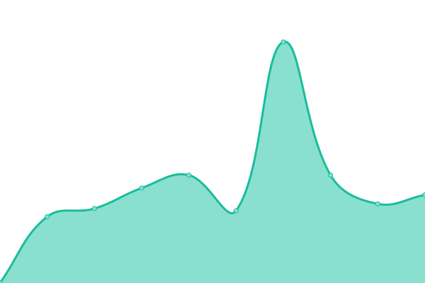
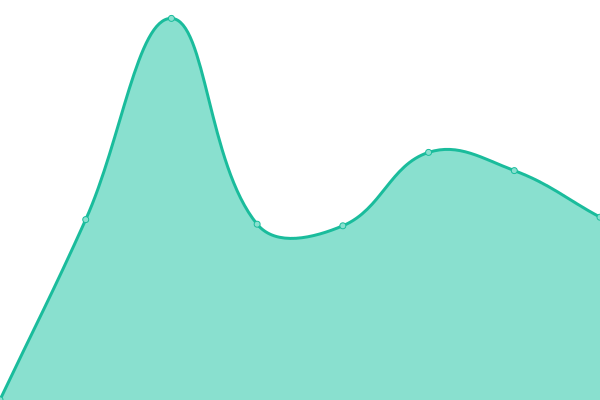

# [📈 Live Status](https://uptime.capgo.app): <!--live status--> **🟩 All systems operational**

This repository contains the open-source uptime monitor and status page for [Capgo](https://capgo.app), powered by [Upptime](https://github.com/upptime/upptime).

With [Upptime](https://upptime.js.org), you can get your own unlimited and free uptime monitor and status page, powered entirely by a GitHub repository. We use [Issues](https://github.com/Cap-go/upptime/issues) as incident reports, [Actions](https://github.com/Cap-go/upptime/actions) as uptime monitors, and [Pages](https://uptime.capgo.app) for the status page.

<!--start: status pages-->
<!-- This summary is generated by Upptime (https://github.com/upptime/upptime) -->
<!-- Do not edit this manually, your changes will be overwritten -->
<!-- prettier-ignore -->
| URL | Status | History | Response Time | Uptime |
| --- | ------ | ------- | ------------- | ------ |
|  [Capgo landing](https://capgo.app) | 🟩 Up | [capgo-landing.yml](https://github.com/Cap-go/upptime/commits/HEAD/history/capgo-landing.yml) | 

 297ms
     
 | 

<a href="https://status.capgo.app/history/capgo-landing">100.00%</a>
    

|  [Webapp](https://web.capgo.app/) | 🟩 Up | [webapp.yml](https://github.com/Cap-go/upptime/commits/HEAD/history/webapp.yml) | 

 236ms
     
 | 

<a href="https://status.capgo.app/history/webapp">100.00%</a>
    

|  [API Load balancer](https://api.capgo.app/ok) | 🟩 Up | [api-load-balancer.yml](https://github.com/Cap-go/upptime/commits/HEAD/history/api-load-balancer.yml) | 

 325ms
     
 | 

<a href="https://status.capgo.app/history/api-load-balancer">100.00%</a>
    

|  [API Cloudflare workers](https://xvwzpoazmxkqosrdewyv.functions.supabase.co/ok) | 🟩 Up | [api-cloudflare-workers.yml](https://github.com/Cap-go/upptime/commits/HEAD/history/api-cloudflare-workers.yml) | 

 520ms
     
 | 

<a href="https://status.capgo.app/history/api-cloudflare-workers">100.00%</a>
    

|  [API AWS](https://web.capgo.app/ok) | 🟩 Up | [api-aws.yml](https://github.com/Cap-go/upptime/commits/HEAD/history/api-aws.yml) | 

 85ms
     
 | 

<a href="https://status.capgo.app/history/api-aws">100.00%</a>
    

|  [API GCP](https://web.capgo.app/ok) | 🟩 Up | [api-gcp.yml](https://github.com/Cap-go/upptime/commits/HEAD/history/api-gcp.yml) | 

 45ms
     
 | 

<a href="https://status.capgo.app/history/api-gcp">100.00%</a>
    

|  [Database Supabase](https://supabase.capgo.app/ok?service=database) | 🟩 Up | [database-supabase.yml](https://github.com/Cap-go/upptime/commits/HEAD/history/database-supabase.yml) | 

 999ms
     
 | 

<a href="https://status.capgo.app/history/database-supabase">100.00%</a>
    

|  [Database Netlify](https://netlify.capgo.app/ok?service=database) | 🟩 Up | [database-netlify.yml](https://github.com/Cap-go/upptime/commits/HEAD/history/database-netlify.yml) | 

 500ms
     
 | 

<a href="https://status.capgo.app/history/database-netlify">100.00%</a>
    

|  [Database Netlify Edge](https://netlify-edge.capgo.app/ok?service=database) | 🟩 Up | [database-netlify-edge.yml](https://github.com/Cap-go/upptime/commits/HEAD/history/database-netlify-edge.yml) | 

 323ms
     
 | 

<a href="https://status.capgo.app/history/database-netlify-edge">100.00%</a>
    

|  [Consistency between providers](https://supabase.capgo.app/test_consistency) | 🟩 Up | [consistency-between-providers.yml](https://github.com/Cap-go/upptime/commits/HEAD/history/consistency-between-providers.yml) | 

 1975ms
     
 | 

<a href="https://status.capgo.app/history/consistency-between-providers">100.00%</a>
    

|  [Update endpoint AWS](https://netlify.capgo.app/ok?service=update) | 🟩 Up | [update-endpoint-aws.yml](https://github.com/Cap-go/upptime/commits/HEAD/history/update-endpoint-aws.yml) | 

 3302ms
     
 | 

<a href="https://status.capgo.app/history/update-endpoint-aws">100.00%</a>
    

|  [Update endpoint GCP](https://netlify-edge.capgo.app/ok?service=update) | 🟩 Up | [update-endpoint-gcp.yml](https://github.com/Cap-go/upptime/commits/HEAD/history/update-endpoint-gcp.yml) | 

 3457ms
     
 | 

<a href="https://status.capgo.app/history/update-endpoint-gcp">100.00%</a>
    

|  [Update endpoint Cloudflare](https://supabase.capgo.app/ok?service=update) | 🟩 Up | [update-endpoint-cloudflare.yml](https://github.com/Cap-go/upptime/commits/HEAD/history/update-endpoint-cloudflare.yml) | 

 3879ms
     
 | 

<a href="https://status.capgo.app/history/update-endpoint-cloudflare">100.00%</a>
    

|  [Stats endpoint AWS](https://netlify.capgo.app/ok?service=stats) | 🟩 Up | [stats-endpoint-aws.yml](https://github.com/Cap-go/upptime/commits/HEAD/history/stats-endpoint-aws.yml) | 

 1066ms
     
 | 

<a href="https://status.capgo.app/history/stats-endpoint-aws">100.00%</a>
    

|  [Stats endpoint GCP](https://netlify-edge.capgo.app/ok?service=stats) | 🟩 Up | [stats-endpoint-gcp.yml](https://github.com/Cap-go/upptime/commits/HEAD/history/stats-endpoint-gcp.yml) | 

 1121ms
     
 | 

<a href="https://status.capgo.app/history/stats-endpoint-gcp">100.00%</a>
    

|  [Stats endpoint Cloudflare](https://supabase.capgo.app/ok?service=stats) | 🟩 Up | [stats-endpoint-cloudflare.yml](https://github.com/Cap-go/upptime/commits/HEAD/history/stats-endpoint-cloudflare.yml) | 

 1362ms
     
 | 

<a href="https://status.capgo.app/history/stats-endpoint-cloudflare">100.00%</a>
    

|  [Plugin Get channels endpoint AWS](https://supabase.capgo.app/ok?service=channel_self_get) | 🟩 Up | [plugin-get-channels-endpoint-aws.yml](https://github.com/Cap-go/upptime/commits/HEAD/history/plugin-get-channels-endpoint-aws.yml) | 

 2540ms
     
 | 

<a href="https://status.capgo.app/history/plugin-get-channels-endpoint-aws">100.00%</a>
    

|  [Plugin Get channels endpoint GCP](https://netlify-edge.capgo.app/ok?service=channel_self_get) | 🟩 Up | [plugin-get-channels-endpoint-gcp.yml](https://github.com/Cap-go/upptime/commits/HEAD/history/plugin-get-channels-endpoint-gcp.yml) | 

 1481ms
     
 | 

<a href="https://status.capgo.app/history/plugin-get-channels-endpoint-gcp">100.00%</a>
    

|  [Plugin Get channels endpoint Cloudflare](https://supabase.capgo.app/ok?service=channel_self_get) | 🟩 Up | [plugin-get-channels-endpoint-cloudflare.yml](https://github.com/Cap-go/upptime/commits/HEAD/history/plugin-get-channels-endpoint-cloudflare.yml) | 

 1321ms
     
 | 

<a href="https://status.capgo.app/history/plugin-get-channels-endpoint-cloudflare">100.00%</a>
    

|  [API Get devices endpoint AWS](https://supabase.capgo.app/ok?service=device_get) | 🟩 Up | [api-get-devices-endpoint-aws.yml](https://github.com/Cap-go/upptime/commits/HEAD/history/api-get-devices-endpoint-aws.yml) | 

 1438ms
     
 | 

<a href="https://status.capgo.app/history/api-get-devices-endpoint-aws">100.00%</a>
    

|  [API Get devices endpoint GCP](https://netlify-edge.capgo.app/ok?service=device_get) | 🟩 Up | [api-get-devices-endpoint-gcp.yml](https://github.com/Cap-go/upptime/commits/HEAD/history/api-get-devices-endpoint-gcp.yml) | 

 1040ms
     
 | 

<a href="https://status.capgo.app/history/api-get-devices-endpoint-gcp">100.00%</a>
    

|  [API Get devices endpoint Cloudflare](https://supabase.capgo.app/ok?service=device_get) | 🟩 Up | [api-get-devices-endpoint-cloudflare.yml](https://github.com/Cap-go/upptime/commits/HEAD/history/api-get-devices-endpoint-cloudflare.yml) | 

 855ms
     
 | 

<a href="https://status.capgo.app/history/api-get-devices-endpoint-cloudflare">100.00%</a>
    

<!--end: status pages-->

[**Visit our status website →**](https://uptime.capgo.app)

## 📄 License

- Powered by: [Upptime](https://github.com/upptime/upptime)
- Code: [MIT](./LICENSE) © [Capgo](https://capgo.app)
- Data in the `./history` directory: [Open Database License](https://opendatacommons.org/licenses/odbl/1-0/)
